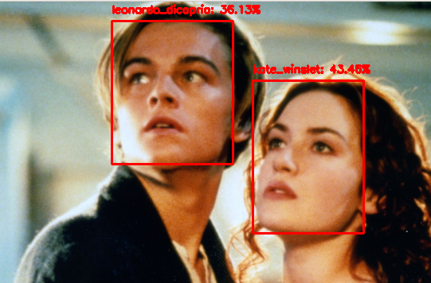
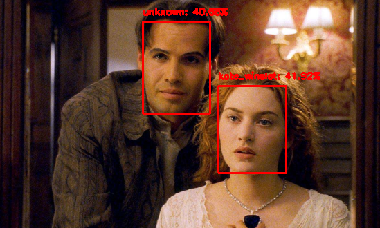
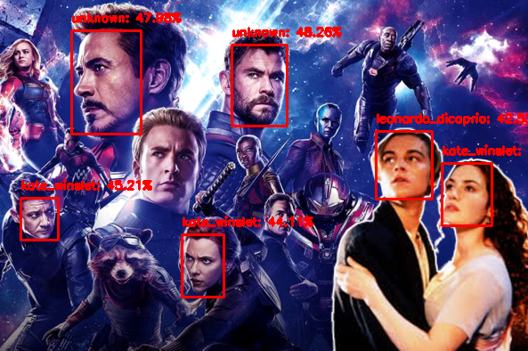

# Introduction
In this tutorial we will try to identify actors from images of Titanic movie.We will train our machine learning model to identify only kate winslet, leonardo dicaprio and rest of them as unknown.

# Techstack
We will learn face detection using opencv, deep learning and machine learning libraries.

# References
I dont take any credit for this. I learned this entire implementation from article written by Adrian Rosebrock  in article https://www.pyimagesearch.com/2018/09/24/opencv-face-recognition/
  